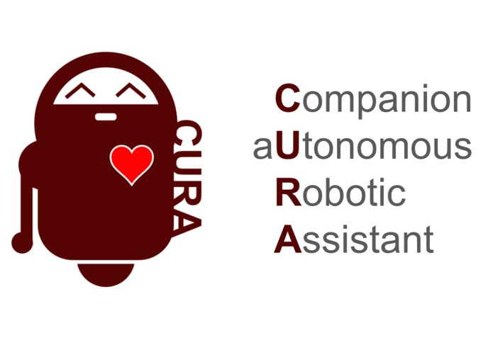

# CURA

### Inspiration
The world population is ageing, and fast. As people live longer, some diseases that would not be significative in the past are becoming a public health problem. In 2030, Europe will have around 14 million of people suffering with dementia. Only the costs with dementia will rise up to 250 billion Euros.

With this is mind; we propose a new approach for the prevention and treatment of a vast group of brain diseases. Mixing the use of the social robot Pepper together with cutting edge Machine Learning from IBM Watson, Microsoft Cognitive Services and classical, well-understood, psychological tests, we aim to help to prevent, diagnose and also to improve the quality of life. Our system will be available 24/7, fulfilling a whole of carer and, why not, friend.

### What it does and How we built it
Pepper is our interface with the world. Its humanoid appearance helps to break the barrier between human and machines, without suffering from the uncanny valley problem. Cloud computer, delivered by IBM Watson, is applied to deliver a robust, reliable speech based interface. Microsoft Cognitive Systems help Pepper to better understand people feelings analysing faces. As an initial test, we implemented the well known Wisconsin Card Sorting Test in order to help with an earlier diagnostics of Alzheimers where the user interacts with the robot through voice commands while his/her feelings are also analysed. At the end of the session, our system is able to generate a full report that can be sent directly to medical doctors, hospitals and carers. Also, since we have access to the patient's exteriorised emotions, the robot could be able to better deal with several common day-by-day situations, fighting back depression, loneliness and helping with simple tasks as remembering to take the medicines.

### Challenges we ran into
The integration between several different systems as Pepper, IBM Watson and MS Cognitive Systems was our biggest challenge. All those systems are something still new, and there're not a vast documentation available demanding from us in-house development of interfaces. The main interface for the game is totally customisable and utilises the power of OpenCV to generate the transitions in a fast and reliable way.

### Accomplishments that we're proud of
Most of the systems were totally new to us and, with only 48h, we were able to break through bugs, lack of sleep and still deliver a demonstration prepared to interact with the real world.

### What we learned
The hackathon, actually, is not much different from the day-by-day of a busy company. Therefore, we believe this experience will be transferred to our professional lives and help us to excel in a challenging environment.

### What's next for CURA - Companion aUtonomous Robotic Assistant
Our next step is to expand the system, deploy an app for Pepper and start planning experiments with human beings to test our hypothesis.

### Built With
python
pepper
ibm-watson
ms cognitive services
opencv
wisconsin-card-sorting-test

### [CURA on Devpost](https://devpost.com/software/cura-companion-autonomous-robot-assistant)
